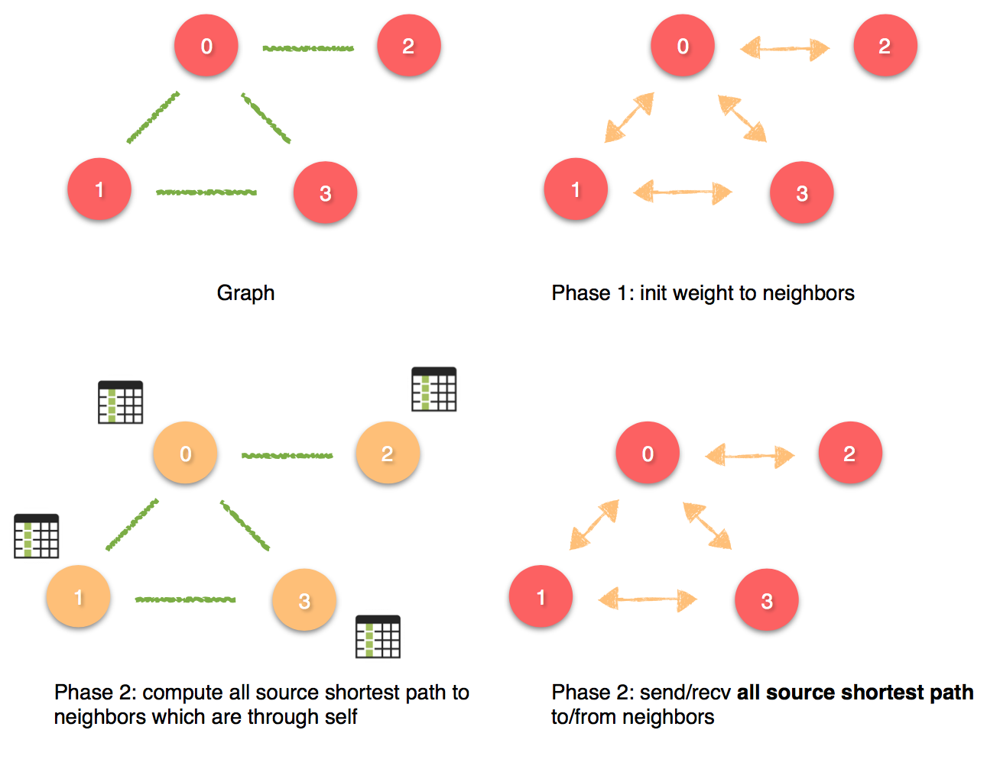

# PP_Hw3 - All Pair Shortest Path
Given an undirected connected graph, output all pair shortest path.

## Pthread version
Because the input is an undirected graph, we only need to compute half of all distance. So simply modified Floyd Warshall algorithm to do some optimization based on above.

## Fully Distributed MPI synchronized version
Under fully distributed graph model's rule, every process hold's a vertex and can only send the message to its neighbors.  
詳細過程如下：  
sync 版本掌握兩個原則
1. 每個 process 只會知道任意點到自己的最短距離。
2. 傳送過程分為兩個 phase。
    - Phase 1：傳送自己到鄰居的 weight 給該鄰居，作為初始化整個計算過程。 而鄰居收到後則會更新對方到自己的最短距離。
    - Phase 2：每個人會先去紀錄所有點經由自己到鄰居的最短距離(也就是所有點到自己的最短距離+自己到鄰居的 weight)，接著將這張表中所有點到鄰居的最短距離一一傳給相對應的鄰居們，鄰居收到後會去看看自己是否要更新，當收集完所有訊息後重複 Phase 2，直到沒有人再繼續更新為止。  
  

Important： 
由於 MPI_Isend 的內部運作機制是會在 memory allocate 一塊空間存放 MPI_Request ，再透過 MPI_Isend api 中你所指定的 pointer 去指向他。因此當今天使用了 MPI_Isend 後沒有去 free 掉這段空間就會導致 memory leak，而當 MPI_Isend 的次數一龐大起來就很容易 crash。因此記得 <b>*任何的 MPI_Isend 後都必須要接 MPI_Wait/MPI_Test 以 free 掉這段存放 MPI_Request 的記憶體空間*</b>。而做法可以利用下次 MPI_Isend 前已經確保對方收到時在 call MPI_Wait，如此就不會發生相互等待的 dead lock。
